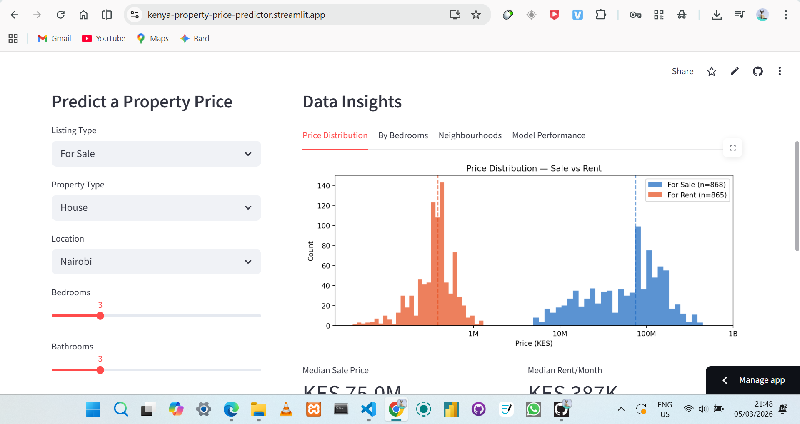
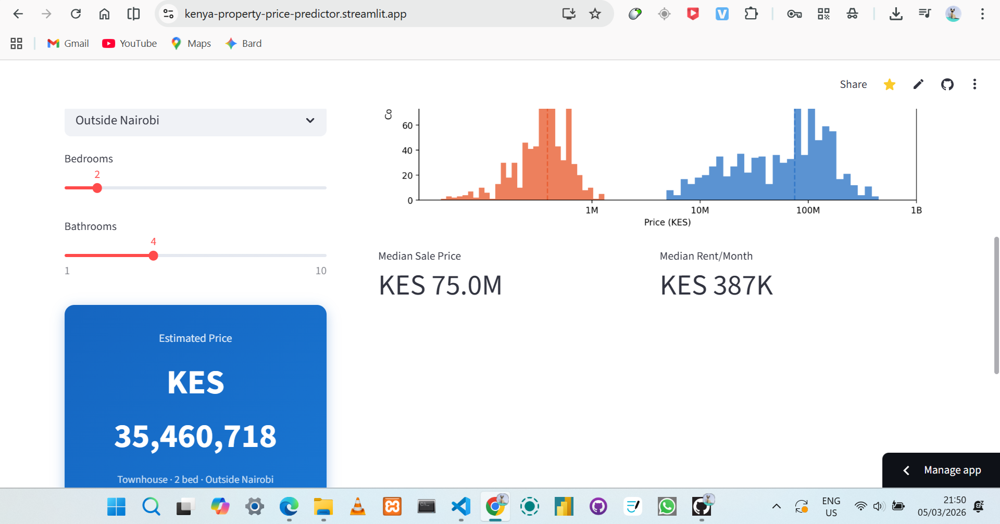

# 🏠 Kenya Property Price Predictor

> End-to-end Data Science project — real data scraped from BuyRentKenya.com, cleaned, analysed and deployed as a live web app.

[](https://kenya-property-price-predictor.streamlit.app/)

🔗 **Live App:** [kenya-property-price-predictor.streamlit.app](https://kenya-property-price-predictor.streamlit.app/)

---

## 📸 Screenshots





---

## 🎯 Project Overview

Most Data Science portfolio projects use pre-cleaned Kaggle datasets. This project collects its own data from scratch.

I scraped **1,733 real Kenyan property listings** from BuyRentKenya.com, cleaned the messy raw data, ran exploratory data analysis, trained a Random Forest model to predict property prices, and deployed everything as a live interactive web app.

**Business Question:** *Given a property's bedrooms, type and location — what should it cost in the Kenyan market?*

---

## 🔄 Project Pipeline

```
SCRAPE  ──►  CLEAN  ──►  EDA  ──►  MODEL  ──►  DEPLOY
```

---

## 📁 Project Structure

```
kenya-property-price-predictor/
│
├── app.py                        # Streamlit dashboard
├── buyrentkenya_scraper_v4.py    # Web scraper
├── cleaning.ipynb                # Data cleaning notebook
├── EDA_model.ipynb               # EDA + ML model notebook
│
├── buyrentkenya_raw.csv          # Raw scraped data  (1,743 rows)
├── buyrentkenya_clean.csv        # Cleaned dataset   (1,733 rows)
│
├── requirements.txt              # Python dependencies
├── app_pic1.png                  # App screenshot 1
├── app_pic2.png                  # App screenshot 2
└── README.md
```

---

## 🔍 Stage Breakdown

### 1️⃣ Web Scraping — `buyrentkenya_scraper_v4.py`

- Built with `requests` and `BeautifulSoup`
- Used Chrome DevTools to identify stable `data-cy` HTML attributes on the site
- Scraped both **For Sale** and **For Rent** listings across 40 pages each
- Fields collected: listing ID, title, price, bedrooms, bathrooms, size, location, property type
- Output: `buyrentkenya_raw.csv` — **1,743 rows**

### 2️⃣ Data Cleaning — `cleaning.ipynb`

- Parsed `"KSh 75,000,000"` → `75000000.0` (clean numeric)
- Extracted numbers from strings like `"4 Bedrooms"` → `4`
- Recovered missing locations from property titles using regex
  - e.g. `"3 Bed House in Lavington"` → `"Lavington"`
- Engineered features: `is_nairobi`, `total_rooms`, `price_per_sqm`, `bedroom_category`
- Removed price outliers and rows missing the target variable
- Output: `buyrentkenya_clean.csv` — **1,733 rows**

### 3️⃣ Exploratory Data Analysis — `EDA_model.ipynb`

Key findings from the data:

| Metric | Value |
|---|---|
| Total listings | 1,733 |
| For Sale | 868 listings |
| For Rent | 865 listings |
| Median sale price | KES 75,000,000 |
| Median rent per month | KES 387,000 |
| Most listed neighbourhood | Lavington (267 listings) |
| Nairobi listings | 1,034 out of 1,733 (60%) |
| Most common property type | House (52%) |

Charts produced:
- Price distribution — Sale vs Rent
- Median price by bedroom count
- Top 10 neighbourhoods by listing count
- Nairobi vs Outside Nairobi price comparison
- Correlation heatmap of numeric features

### 4️⃣ Machine Learning Model — `EDA_model.ipynb`

| Setting | Value |
|---|---|
| Algorithm | Random Forest Regressor |
| Trees | 100 |
| Train / Test Split | 80% / 20% |
| R² Score | 0.683 |
| RMSE | KES 35,600,000 |

**Features used:**

| Feature | Description |
|---|---|
| `bedrooms` | Number of bedrooms |
| `bathrooms` | Number of bathrooms |
| `total_rooms` | Bedrooms + bathrooms combined |
| `is_sale` | 1 = For Sale, 0 = For Rent |
| `is_nairobi` | 1 = Nairobi area, 0 = Outside Nairobi |
| `property_type_encoded` | House=0, Townhouse=1, Villa=2 |

The model explains **68.3%** of property price variance using only 6 features.

### 5️⃣ Streamlit Dashboard — `app.py`

Live interactive app with:
- 🔮 **Price Predictor** — select listing type, property type, location, bedrooms and bathrooms → get an instant predicted price in KES
- 📊 **4 chart tabs** — Price Distribution, By Bedrooms, Neighbourhoods, Model Performance
- 📈 **Market context** — shows where the predicted price ranks against all listings in the dataset
- 🏆 **Key metrics** — total listings, R² score, RMSE and median price displayed at the top

---

## 📊 Key Insights

1. **Nairobi commands a strong price premium** — properties in Nairobi are significantly more expensive than those outside Nairobi even with the same number of bedrooms
2. **Bedroom count drives price** — median sale price scales consistently from 1-bed to 6-bed properties
3. **Lavington, Runda and Karen dominate** — these three neighbourhoods account for the majority of high-end listings
4. **Sale vs Rent is near equal** — 868 for-sale vs 865 for-rent, a well-balanced dataset
5. **Villas carry the highest median price** — despite being only 13% of listings

---

## 🚀 Run Locally

```bash
# 1. Clone the repo
git clone https://github.com/symo101/kenya-property-price-predictor.git
cd kenya-property-price-predictor

# 2. Install dependencies
pip install -r requirements.txt

# 3. Run the dashboard
streamlit run app.py
```

App opens at `http://localhost:8501`

---

## 🛠️ Tech Stack

| Tool | Purpose |
|---|---|
| `requests` + `BeautifulSoup` | Web scraping |
| `pandas` + `numpy` | Data cleaning and manipulation |
| `matplotlib` + `seaborn` | Data visualisation |
| `scikit-learn` | Random Forest model |
| `Streamlit` | Web app and deployment |

---

## 📦 Requirements

```
requests
beautifulsoup4
pandas
numpy
matplotlib
seaborn
scikit-learn
lxml
streamlit==1.32.0
altair==5.2.0
```

---

## 📂 Dataset

| File | Rows | Description |
|---|---|---|
| `buyrentkenya_raw.csv` | 1,743 | Raw scraped data — messy strings, missing values |
| `buyrentkenya_clean.csv` | 1,733 | Cleaned, numeric, feature-engineered — ML ready |

Data scraped from [BuyRentKenya.com](https://www.buyrentkenya.com) in March 2026 for educational purposes.

---

## 👤 Author

**Simon**

- 🐙 GitHub: [github.com/symo101](https://github.com/symo101)
- 🔗 Live App: [kenya-property-price-predictor.streamlit.app](https://kenya-property-price-predictor.streamlit.app/)

---

## 📄 License

This project is open source and available under the [MIT License](LICENSE).

---

*Data scraped from BuyRentKenya.com in March 2026 for educational and portfolio purposes only.*
